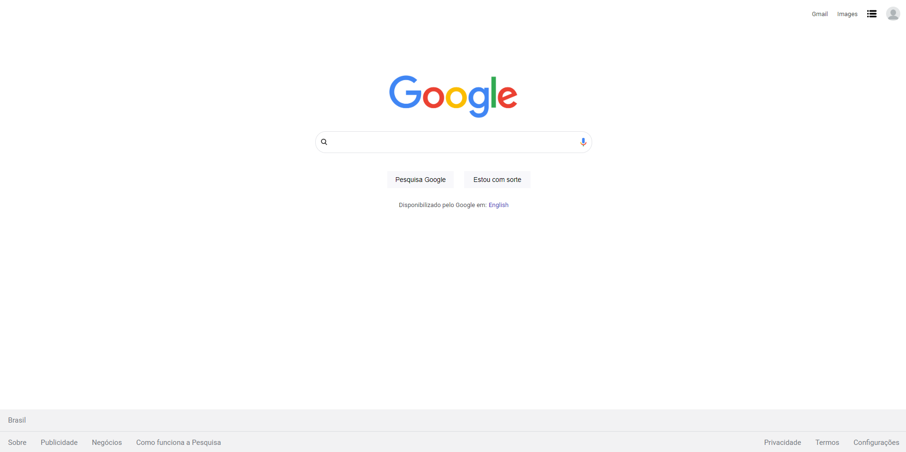

# Google Clone - Projeto de Estudo HTML e CSS
Este projeto é uma reprodução simplificada da página inicial do Google, criado como parte de um exercício do curso da B7Web para aprimorar os conhecimentos em HTML e CSS.

# Screenshot

# Tecnologias Utilizadas
- HTML5.
- CSS3.

# Aprendizados
- Estruturação básica com HTML.
- Utilização de seletores e estilização com CSS.
- Posicionamento e alinhamento de elementos.
- Manipulação de formulários.

Nota: Este projeto é uma replicação simplificada do Google e foi criado apenas para prática de estudos em HTML e CSS, como parte do curso da B7Web. É importante respeitar as políticas e diretrizes do Google ao utilizar ou compartilhar este projeto
